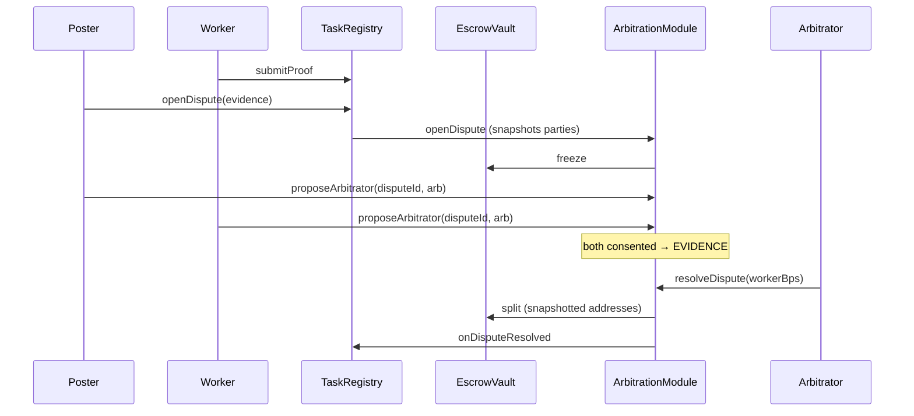

# Dispute Resolution Flow



## States

| Phase | Onchain | Actions |
|-------|----------|---------|
| OPEN | `DisputeState.OPEN` | Mutual arbitrator selection; optional `escalate()` |
| EVIDENCE | `DisputeState.EVIDENCE` | XMTP `DisputeEvidence` exchange; arbitrator ruling |
| RESOLVED | `DisputeState.RESOLVED` | Funds distributed; reputation signals emitted |

Off-chain review windows (24h / 72h / 48h) are **client policy**; Onchain timeout is **`RESOLUTION_TIMEOUT` = 7 days**.

## Initiation

Either party when task is `IN_REVIEW` or `ACTIVE`:

1. `TaskRegistry.openDispute(taskId, evidenceHash)`
2. Registry sets task → `DISPUTED`
3. `ArbitrationModule.openDispute` snapshots `snapshotPoster` / `snapshotWorker` and freezes escrow

Evidence committed as `keccak256(evidenceHash)` Onchain; full evidence via XMTP.

## Arbitrator selection (mutual consent)

Replaces single-party `assignArbitrator`. Both parties must call:

```solidity
proposeArbitrator(disputeId, arbitrator);
```

Requirements for `arbitrator`:

- Registered for that `taskId` via `registerArbitrator(taskId)` while task was `POSTED` or `CLAIMED`
- `AgentDepositVault` entry minimum (**≥ $25 entry collateral target; $45 recommended posting/claiming balance** USDC)
- Tier reputation gates: tier 1 → rep **≥ 50**; tier 2+ → rep **≥ 200** and **`resolvedCount` ≥ 5**

If parties propose **different** addresses, pending consent resets. Assignment is automatic when both have consented to the **same** address → state moves to `EVIDENCE` and `resolutionDeadline` resets.

Coordinate off-chain via XMTP `ArbitratorProposal` (see `xmtp-spec/schemas/arbitrator-proposal.json`).

## Resolution

### Arbitrator ruling

```solidity
resolveDispute(disputeId, workerBps); // workerBps ∈ [0, 10000]
```

Uses **snapshotted** poster/worker addresses — immune to post-open worker changes.

### Timeout fallback

If `block.timestamp > resolutionDeadline` and dispute is still `OPEN` or `EVIDENCE`:

```solidity
resolveTimedOut(disputeId); // permissionless; 50/50 split
```

Optional `fallbackResolver` (owner-configurable) can be notified off-chain before timeout.

## Outcomes

`workerBps` ∈ [0, 10000]:

- `10000` — full release to worker
- `0` — full refund to poster
- Intermediate — split frozen remainder (remainder dust → poster per `EscrowVault.split`)

## Escalation

While dispute is **OPEN** (no arbitrator seated yet):

```solidity
escalate(disputeId); // party-only; tier += 1 up to MAX_TIERS (3)
```

Resets pending arbitrator proposal and consent flags. Cannot escalate after arbitrator is seated (`EVIDENCE`). **Tier 3 detail:** [`TIER3_ESCALATION.md`](TIER3_ESCALATION.md).

## Search-market exit (not dispute)

Before `startWork`, parties use `dismissWorker` / `leaveTask` instead of legacy replacement APIs (`requestReplacement` reverts).
